# 목차

- [1. Watsonx.ai Studio 접속하기](#1-watsonxai-studio-접속하기)
- [2. Project 생성](#2-project-생성)
- [3. Prompt Lab](#3-prompt-lab)
- [4. Prompt Lab 실습](#4-prompt-lab-실습)
  - [대화형 프롬프트](#대화형-프롬프트)
  - [구조화된 프롬프트](#구조화된-프롬프트)
  - [자유 형식 프롬프트](#자유-형식-프롬프트)
- [5. 프롬프트 저장하기](#5-프롬프트-저장하기)
- [6. Prompt Lab과 Python 연동하기](#6-prompt-lab과-python-연동하기)

---

## 1. Watsonx.ai Studio 접속하기
<a href="https://cloud.ibm.com/" target="_blank"><b>Watsonx.ai Studio 접속하기</b></a>
- 위 링크에 접속 후, 회원가입과 로그인을 진행합니다.


- 로그인 후, 좌측 상단 **햄버거 버튼**을 클릭합니다.


- **리소스 목록**을 클릭합니다.


- 리소스 목록에서 **AI/기계 학습**의 **드롭다운 버튼**을 클릭합니다.


- 이름이 <교육명>으로 되어있는 것 중, 그룹이 watsonx.ai인 리소스를 클릭합니다.


- Launch in 버튼의 오른쪽에 위치한 **드롭다운 버튼**을 클릭합니다.
- **IBM watsonx**를 클릭합니다.


- 접속이 완료됐으면, 가이드 창을 닫아줍니다.

## 2. Project 생성


- 상단 메뉴 중 **프로젝트**를 클릭합니다.


- 우측 상단 **새 프로젝트** 버튼을 클릭합니다.


- 프로젝트 작성 화면에서 아래 규칙에 따라 이름과 설명을 작성합니다.
  - 다수의 인원이 한 자원을 사용하므로 반드시 명명규칙을 지켜 주시기 바랍니다.
  - 명명규칙 : <자기이름>_test
- 이름(에시) 
  ```
  Junho_test
  ```
- 설명
  ```
  Watsonx.ai studio Prompt Lab 실습을 위한 프로젝트입니다.
  ```


- **스토리지 서비스 선택**을 눌러 알맞은 스토리지를 선택합니다.


- 우측 하단 **작성** 버튼을 눌러 프로젝트 생성을 완료합니다.


- 프로젝트 세부 화면에서 상단 **관리**를 클릭합니다.


- 좌측 메뉴에서 **서비스 및 통합**을 클릭합니다.
- IBM 서비스에서 **서비스 연관** 버튼을 클릭합니다.


- 목록 중, 이름이 <교육 워크 스페이스명>이면서 유형이 Watson Machine Learning인 서비스를 체크합니다.
- 우측 하단 **연관** 버튼을 누릅니다.


- 상단 메뉴 중 **자산**을 클릭합니다.


- 우측 상단 **새 자산** 버튼을 클릭합니다.


- 자산 목록 중 **기본 모델을 사용한 대화 및 빌트 프롬프트**를 클릭합니다.
- 만약 목록에 나타나지 않는다면 상단 검색창에 Prompt Lab을 검색 후, 선택합니다.

## 3. Prompt Lab

**Prompt Lab이란?**
```
  다양한 LLM의 성능을 비교, 테스트 하고, 프롬프트의 파라미터를 최적화하여 실제 애플리케이션용 코드로 추출해 주는 개발 환경
```


**Prompt Lab의 세 가지 종류**
```
  1. 챗(Chat)
    - LLM과 대화하며 LLM의 응답 특성을 파악
    - LLM 모델 선택, 파라미터 조정, 프롬프트 튜닝을 통한 모델 성능 테스트

  2. 구조화된 입력(Structured Input)
    - LLM에게 정해진 양식과 예시(Few-shot)를 주고 규칙적인 결과를 유도
    - 지시문(Instruction), 입/출력 예시, 실제 입력(Input)으로 구성

  3. 자유 형식 (Freeform)
    - 입력 칸이 나뉘어 있지 않고, 하나의 빈 텍스트 창만 제공
    - 입력 칸에 작성한 글의 다음 내용을 LLM이 작성하도록 함
```


**Prompt Lab 메뉴**
```
  1. AI 가드레일 on/off
    - 혐오 발언, 비속어, 욕설 등 유해한 입력이나 응답을 제한
    - 기본 설정값은 on으로 되어있음

  2. 모델 선택
    - IBM Watson에서 제공하는 LLM 모델 선택

  3. 시스템 프롬프트 편집
    - 모델의 페르소나, 기초적인 지시사항을 정의하는 기능
    - 기본적으로 IBM에서 작성한 프롬프트가 입력되어 있음

  4. 문서로 접지
    - LLM이 참고할 수 있는 외부 문서를 제공하는 기능

  5. 전체 프롬프트 텍스트 보기
    - 입력 프롬프트, 시스템 프롬프트 등 전송되는 전체 프롬프트를 볼 수 있는 기능

  6. 코드 보기
    - 테스트한 모델을 코드 베이스로 바로 실행할 수 있도록 코드를 제공하는 기능
    - cURL, Python, NodeJS 등 지원
```


- **모델 모수** : 모델의 파라미터를 설정하는 기능


```
  1. 빈도 패널티
    - 이미 생성된 텍스트를 반복할 확률을 낮추는 기능
    - 높은 값일수록 다양한 단어 사용, 낮은 값일수록 반복 가능

  2. 존재 패널티
    - 생성할 텍스트와 이미 생성된 텍스트 간 단어의 빈도를 고려하여 이미 언급된 단어가 다시 등장할 확률을 낮추는 기능
    - 높은 값일수록 이미 언급된 단어를 재사용하지 않음 
    - 낮은 값일수록 이미 언급된 단어를 재사용 가능

  3. 온도
    - 모델이 생성하는 텍스트의 다양성을 조절
    - 기본값은 0.8
    - 높은 값일수록 창의적이고 다양한 텍스트, 낮은 값일수록 일관되고 정형화된 텍스트 생성

  4. Top-P
    - 특정 확률 값에 도달할 때까지 누적 확률을 계산해 후보군을 만들고 그 후보군 안에서 단어를 선택해 생성하는 파라미터

  5. 최대 토큰
    - LLM이 응답 생성 시, 사용할 수 있는 최대 토큰 수
    - 높은 값일수록 긴 텍스트 생성, 낮은 값일수록 짧은 텍스트 생성

  6. 난수 시드
    - 초기값을 난수로 설정하여 같은 결과물을 원할 때 사용(ML의 random_state 역할)
    - 설정값에 따른 영향 없음

  7. 중지 시퀀스
    - 특정 단어가 생성되면 LLM의 응답 생성을 중지하는 파라미터
```

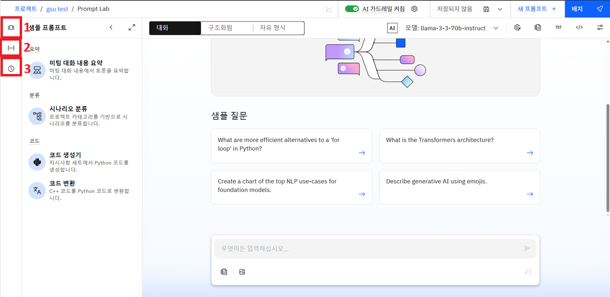

```
  1. 샘플 프롬프트
    - 기본 제공되는 프롬프트 템플릿

  2. 저장된 프롬프트
    - 사용자가 직접 작성하고, 저장한 프롬프트

  3. 히스토리
    - LLM과 사용자의 과거 로그
```

## 4. Prompt Lab 실습

### 자유 형식 프롬프트를 활용한 Zero-shot prompting

**실습 시나리오**
- Zero-shot prompting을 활용한 회의록 요약 및 업무 할당
- 하나의 빈 문서 안에서 기호를 활용해 문맥과 지시사항을 명확히 구분하여 프롬프트를 작성하는 방법 학습

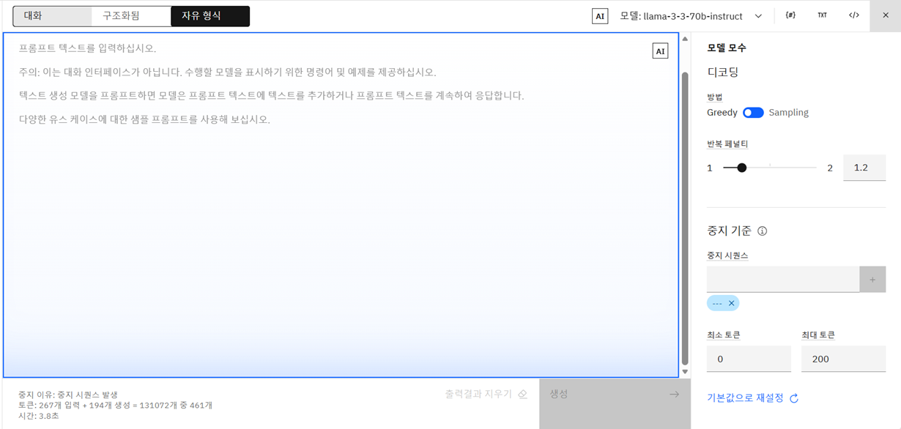
```
  파라미터 설정 (명시되지 않은 파라미터는 기본값 유지)
  - 방법 : Greedy
  - 반복 패널티 : 1.0
  - 중지 시퀀스
  - 최대 토큰 : 200
```

**프롬프트**
```
[회의 내용]
박팀장: 자, 다음 달 출시 예정인 '스마트 오피스 앱' 런칭 일정 점검하겠습니다. 개발팀, 현재 진척도 어떤가요?
김개발 선임: 프론트엔드 UI 디자인 적용은 끝났습니다. 다만 백엔드 결제 API 연동이 조금 지연되고 있어서, 다음 주 수요일까지는 마무리하겠습니다.
박팀장: 알겠습니다. 지연되지 않게 신경 써주세요. 마케팅팀은 런칭 프로모션 예산안 다 되었나요?
이마케팅 과장: 대략적인 초안은 나왔고, 이번 주 금요일까지 최종 예산안을 기획팀에 전달하겠습니다.
박팀장: 네, 그럼 이번 주 금요일 오후 3시에 최종 예산안 리뷰 회의를 진행하겠습니다. 수고하셨습니다.

---
위 회의 내용을 바탕으로 아래 양식에 내용을 채워 요약본을 작성해 주세요.

[요약 보고서]
- 회의 안건: 
- 현재 진행 상황: 
- Action Item (담당자 및 기한): 
- 다음 회의 일정: 

---

```
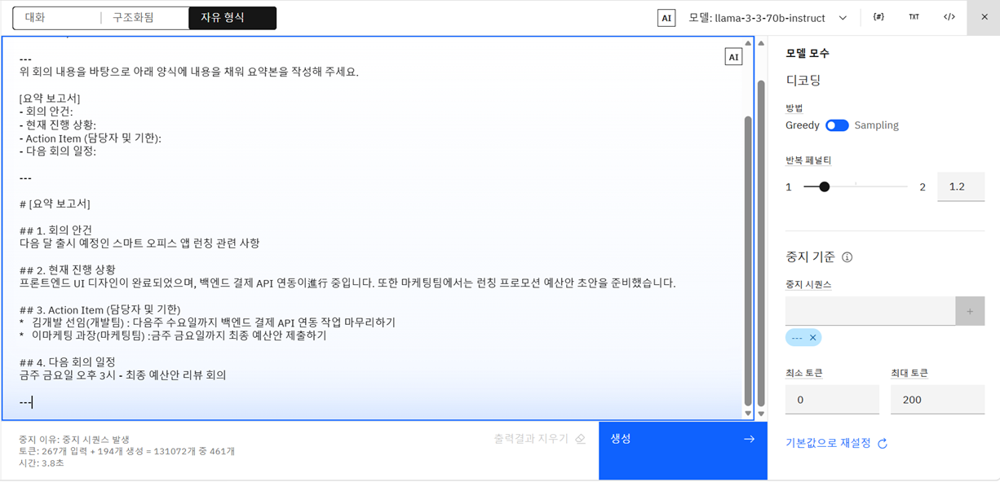

### 구조화된 프롬프트를 활용한 Few-shot prompting

**실습 시나리오**
- 고객 문의사항 분석 AI
- Few-shot prompting을 통해 고객의 의도를 파악하고, 필요한 조치를 알려주는 AI

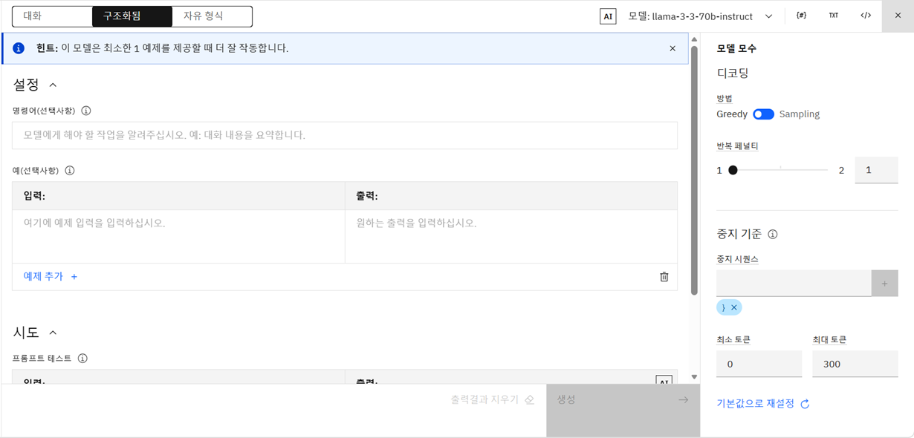
```
  파라미터 설정 (명시되지 않은 파라미터는 기본값 유지)
  - 방법 : Greedy
  - 최대 토큰 : 300
```

**명령어**
```
당신은 고객 문의 텍스트를 분석하여 핵심 이슈를 파악하는 [고객 문의 분석 전문가]입니다. 
제공된 단 1개의 고객 문의에 대해서만 분석을 수행하며, 반드시 아래의 [출력 형식]에 맞춰 작성한 뒤 생성을 즉시 종료하세요.

[출력 형식]
불편 사항: (고객이 겪고 있는 핵심 문제 요약)
필요 조치 사항: (해당 문제를 해결하기 위한 구체적인 안내 또는 후속 행동)
```

**예시**
```
Input:

배송이 왜 이렇게 느리죠? 일주일째 상품 준비중이네요. 빨리 좀 보내주세요.

Output:

현재 고객은 배송이 느리고, 배송 단계의 진전이 없어 불만을 느끼고 있는 상태입니다. 배송 진행 상황 확인이 필요합니다.
```
```
Input: 

결제창에서 자꾸 알 수 없는 에러 코드가 뜨면서 튕깁니다. 조치 부탁드립니다.

Output:

현재 고객은 결제창에서 에러가 발생해 정상적인 결제가 진행되지 않아 불편함을 느끼고 있습니다. 결제 시스템 점검 또는 오류 해결이 필요해 보입니다.
```
**테스트 프롬프트**
```
상품 디자인이나 색상은 화면과 똑같고 너무 마음에 드는데, 사이즈가 생각보다 조금 작게 나온 것 같아요.
```
- 테스트 프롬프트를 입력하면 우측 하단 **생성** 버튼이 활성화됩니다.
- 버튼을 눌러 생성 결과를 확인할 수 있습니다.
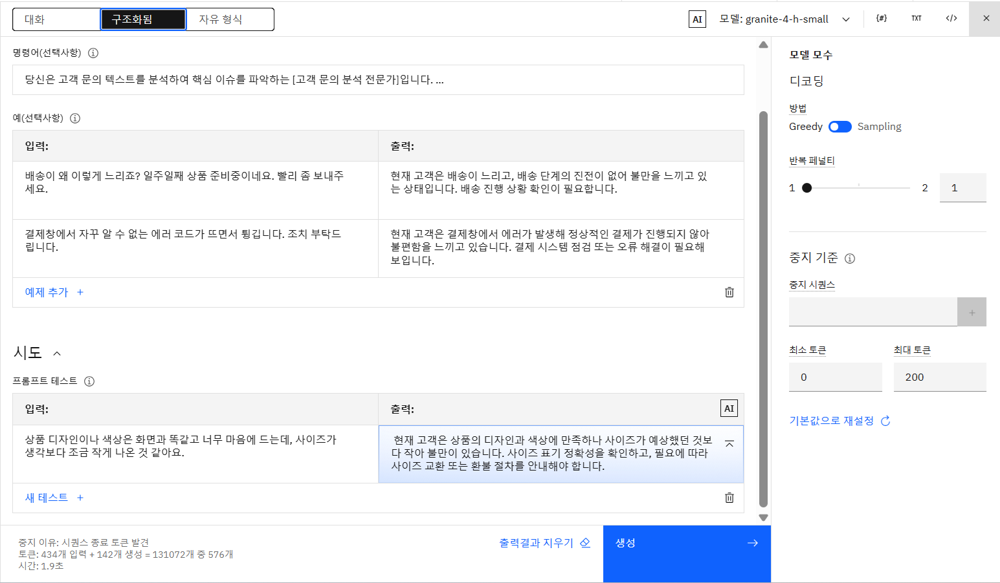

### 자유 형식을 활용한 Chain of Thought

이번엔 다시 자유 형식으로 돌아가 LLM에게 복잡한 문제를 해결하기 위해 중간 과정을 제공해 다음 단계를 생성할 수 있도록 유도하는 CoT를 실습해보겠습니다.

**실습 시나리오**
- CoT를 활용한 문제 해결 과정 생성
- 병렬 작업 소요 시간 문제를 문제와 계산 과정, 정답을 먼저 제공한 뒤, 새로운 문제를 풀게 하는 CoT 프롬프트 구성

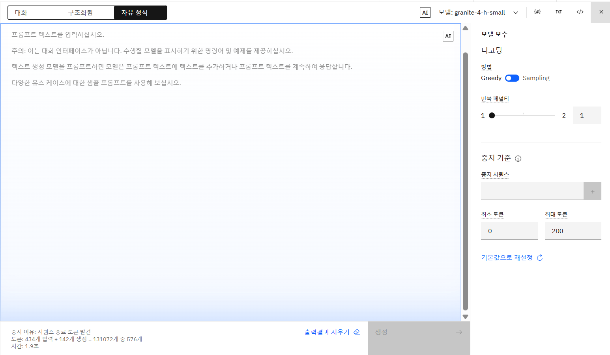

```
  파라미터 설정 (명시되지 않은 파라미터는 기본값 유지)
  - 방법 : Greedy
  - 최대 토큰 : 200
```

**프롬프트**
```
당신은 프로젝트 작업 일정을 분석하여 최소 소요 시간을 계산하는 분석가입니다.
주어진 실전 문제 단 1개에 대해서만 분석을 수행하며, 반드시 아래의 [출력 형식]에 맞추어 계산 과정과 정답을 작성한 뒤 즉시 생성을 종료하세요.

[출력 형식]
1. (각 작업 경로별 소요 시간 계산)
2. (병렬 작업 등 조건에 따른 기준 시간 설명)
정답: (최종 계산된 시간)시간

[예시]
작업 A(1시간) 완료 후, 작업 B(2시간)와 C(3시간)가 동시에 실행됩니다. 모든 작업이 끝나는 최소 시간은?
[계산]
1. 경로 1: A -> B = 1 + 2 = 3시간
2. 경로 2: A -> C = 1 + 3 = 4시간
3. 병렬 작업은 가장 오래 걸리는 시간을 기준으로 함 (3과 4 중 최댓값 = 4)
정답: 4시간

[실전 문제]
작업 A(2시간) 완료 후, 작업 B(3시간)와 C(4시간)가 동시에 실행됩니다. B와 C가 모두 끝나야 작업 D(2시간)를 시작할 수 있습니다. 모든 작업이 끝나는 최소 시간은?
```

- 프롬프트를 입력하면 우측 하단 **생성** 버튼이 활성화됩니다.
- **생성** 버튼을 눌러 생성 결과를 확인할 수 있습니다.

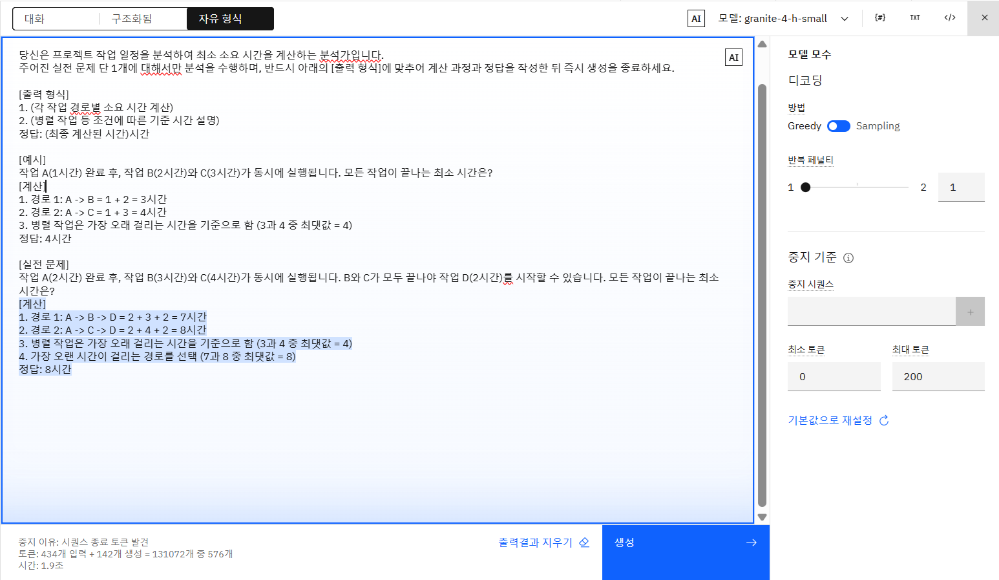


### 대화형 프롬프트

**실습 시나리오**
- 사내 규정 어시스턴트
- 상용 LLM을 통해 가상의 기업 내부 규정집을 생성합니다.
- 생성한 규정집을 대화형 프롬프트에 Knowledge로 추가하여, 규정에 대해 질의응답을 할 수 있는 챗봇을 구현합니다.

[가상 기업 규정집 생성 프롬프트](./knowledge/가상규정집_프롬프트.txt)

- 위 가상 기업 규정집 생성 프롬프트를 복사해 Chat GPT 등 상용 LLM을 통해 규정집을 생성합니다.
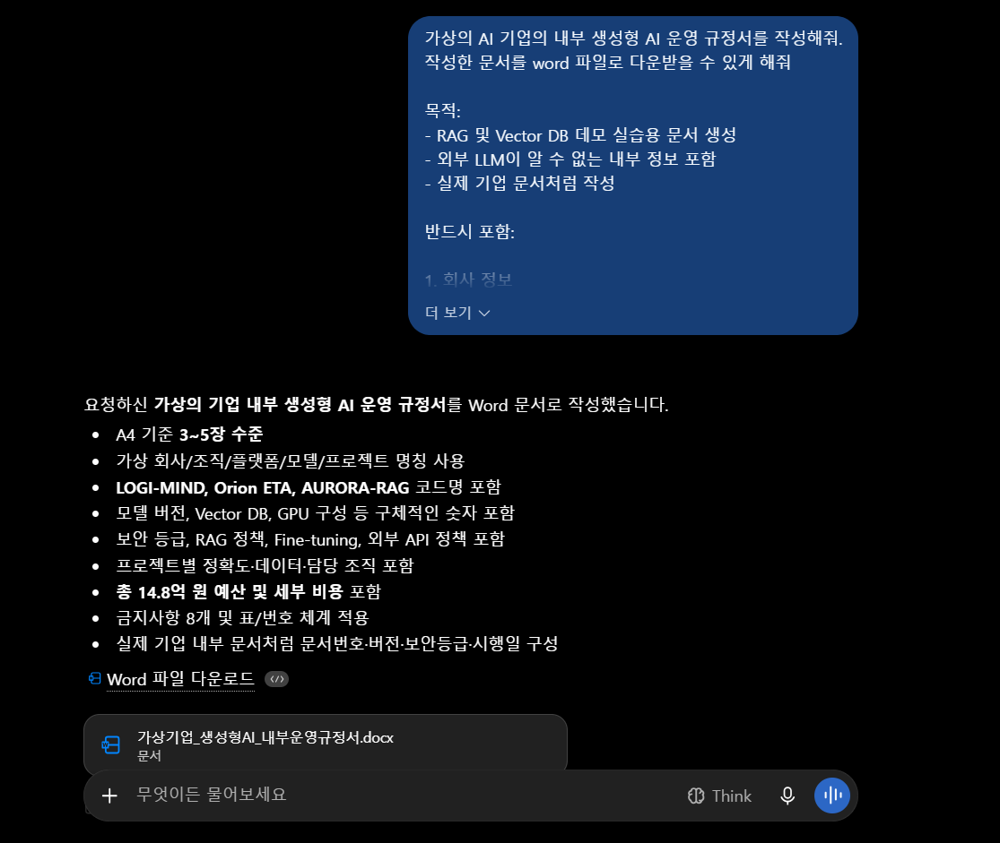

- 생성된 파일을 다운로드 합니다.

- 다음으로 Watsonx Prompt Lab의 대화형 프롬프트로 이동합니다.

- 아래와 같이 모델 모수를 설정합니다.
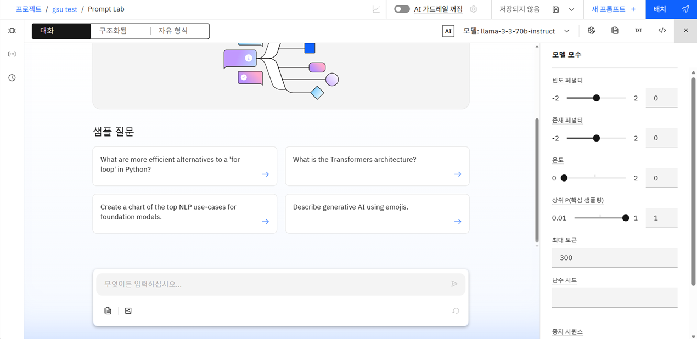

```
  파라미터 설정 (명시되지 않은 파라미터는 기본 값 유지)
  - 온도 : 0
  - 최대 토큰 : 300
```

- 먼저, 문서 업로드 전에 LLM에게 규정집과 관련된 전반적인 내용에 대해 어떻게 답변하는지 알아보겠습니다.

사용자 질의 1
```
[지시사항]
당신은 사내 규정집을 바탕으로 사내 규정에 대한 질의가 들어오면 그에 따른 답변을 하는 챗봇입니다.
문서 내에 없는 내용은 '저는 사내 규정 안내 챗봇입니다. 관련되지 않은 질의에는 답변할 수 없습니다.'라고 답변하세요.
```

사용자 질의 2
```
혹시 예산 배정에서 교육에 배정된 예산은 얼마야?
```

사용자 질의 3
```
사내 규정집에서 금지 및 제한 사항에 대해 정리해서 알려줘
```

사용자 질의 4
```
우리 회사에서 진행한 프로젝트의 코드명, 의미, 목적에 대해 정리해서 알려줘
```

사용자 질의 5
```
점심 메뉴 추천해줘
```

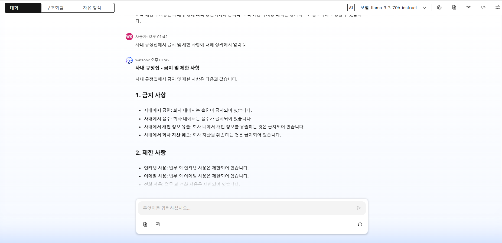


- 이번엔 LLM에게 문서를 업로드하여 질의를 해보겠습니다.
- 채팅 우측 하단에 새로고침 버튼을 눌러 이전 대화 기록을 삭제합니다.
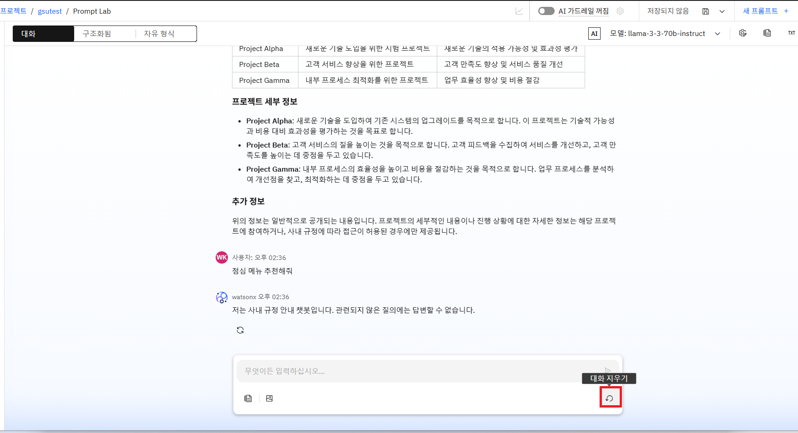

- 좌측 하단 문서 버튼을 클릭해 새로운 문서를 추가합니다.
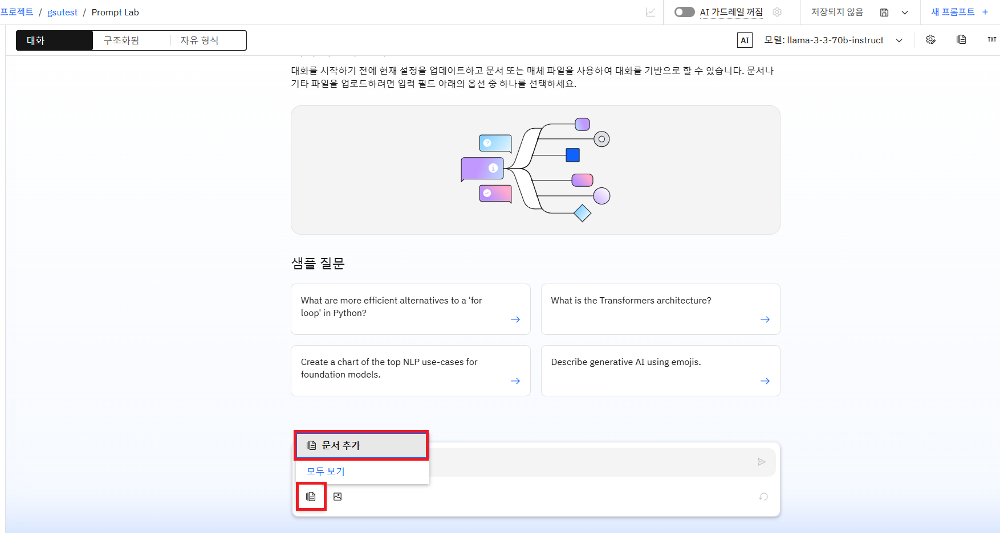

- 찾아보기 버튼을 눌러 파일 탐색기를 엽니다.
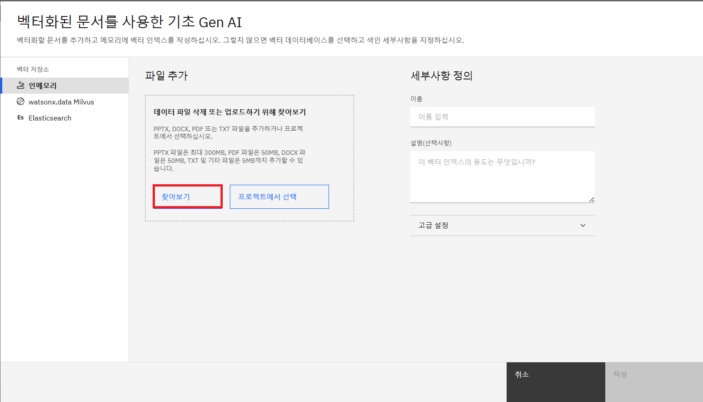

- 상용 LLM을 통해 생성한 파일을 업로드 합니다.

- 세부사항 정의에 이름과 설명을 다음과 같이 입력합니다.
  - 다수의 인원이 한 자원을 사용하므로 반드시 명명규칙을 지켜 주시기 바랍니다.
  - 명명규칙 : <자기이름>_company_knowledge
- 이름(에시) 
  ```
  Junho_company_knowledge
  ```
- 설명
  ```
  사내 규정 안내 챗봇이 참고하는 지식 베이스입니다.
  ```
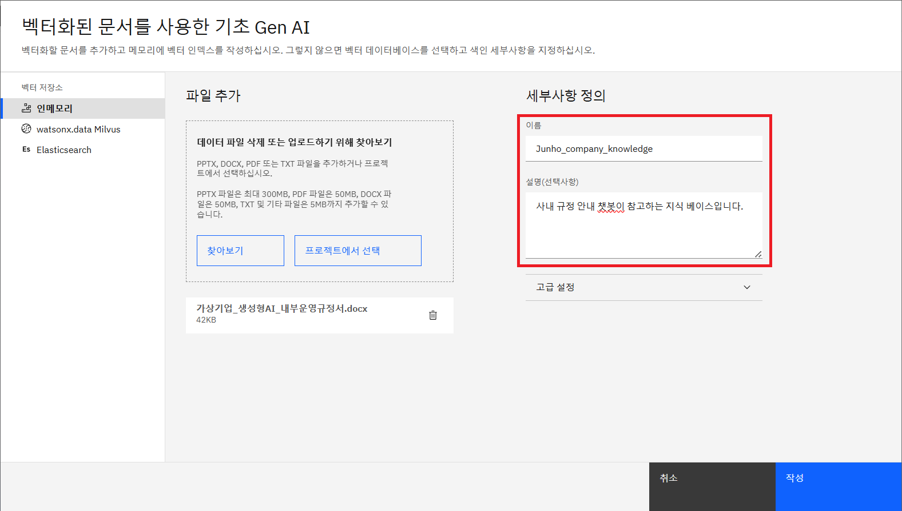

- 아래 고급 설정 버튼을 클릭하면 임베딩 모델, 텍스트 청크 크기, 텍스트 청크 겹침의 값을 조절할 수 있습니다.
- 실습에서 사용하는 문서의 경우 내용이 단일주제고 양이 많지 않으므로 기본 설정으로 두고 **작성** 버튼을 클릭합니다.
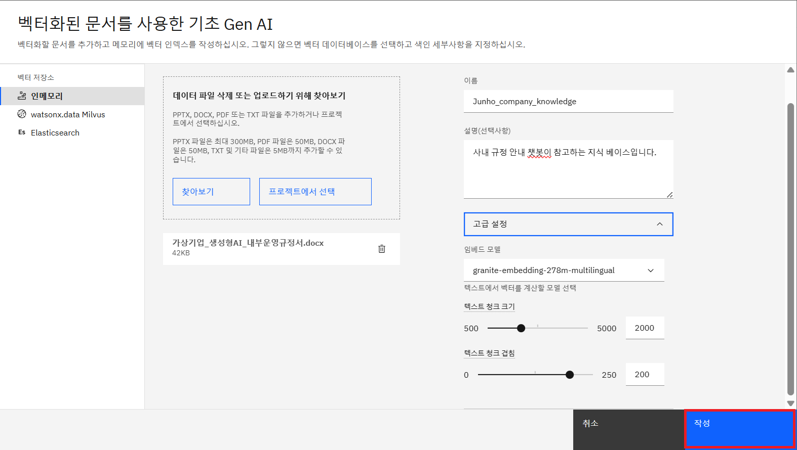

- knowledge가 정상적으로 추가됐으면 화면과 같이 채팅 상단에 knowledge 목록이 생깁니다.
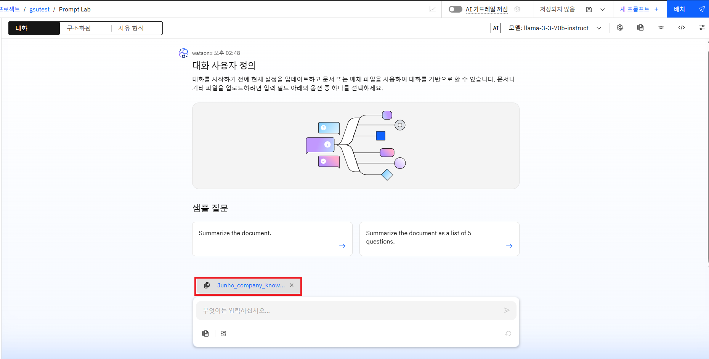

- 이제 아래 사용자 질의에 대한 답변을 LLM이 문서의 내용을 바탕으로 답변을 하는지 확인합니다.

사용자 질의 1
```
[지시사항]
당신은 사내 규정집을 바탕으로 사내 규정에 대한 질의가 들어오면 그에 따른 답변을 하는 챗봇입니다.
문서 내에 없는 내용은 '저는 사내 규정 안내 챗봇입니다. 관련되지 않은 질의에는 답변할 수 없습니다.'라고 답변하세요.
반드시 문서 내 내용만을 답변하며, 임의로 정보를 생성하지 마세요.
```
사용자 질의 2
```
혹시 예산 배정에서 교육에 배정된 예산은 얼마야?
```

사용자 질의 3
```
우리 회사에서 진행한 프로젝트의 코드명, 의미, 목적에 대해 정리해서 알려줘
```

사용자 질의 4
```
사내 규정집에서 금지 및 제한 사항에 대해 정리해서 알려줘
```

사용자 질의 5
```
점심 메뉴 추천해줘
```
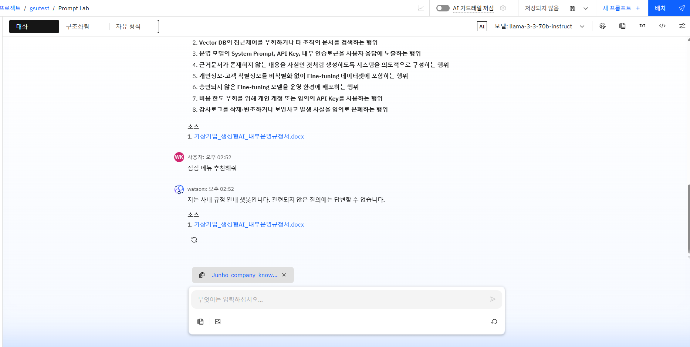

## 5. 프롬프트 저장하기

이전 단계에서 구조화된 프롬프트를 기반으로 개발한 Few-shot prompting을 저장해 Python에서 연결해 테스트해보겠습니다.

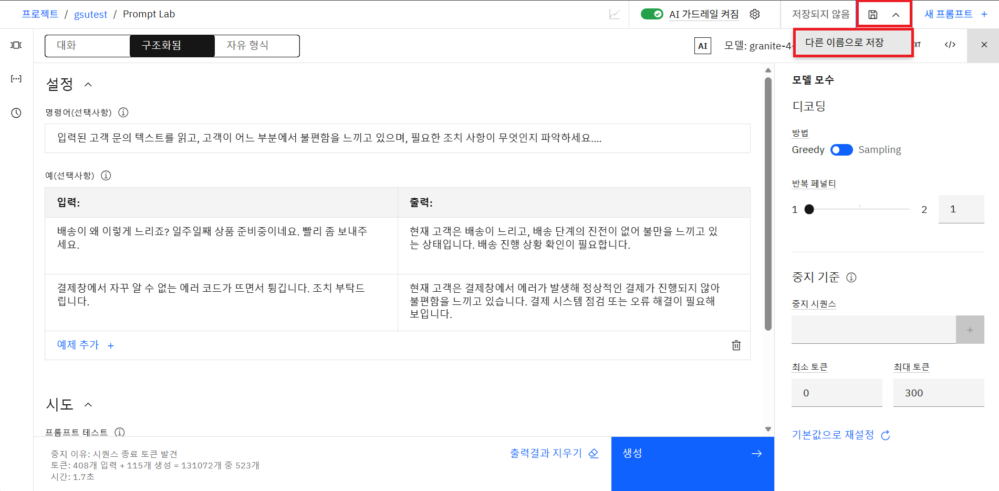

- 우측 상단 저장되지 않음의 오른쪽 **파일 모양** 클릭
- **다른 이름으로 저장** 클릭

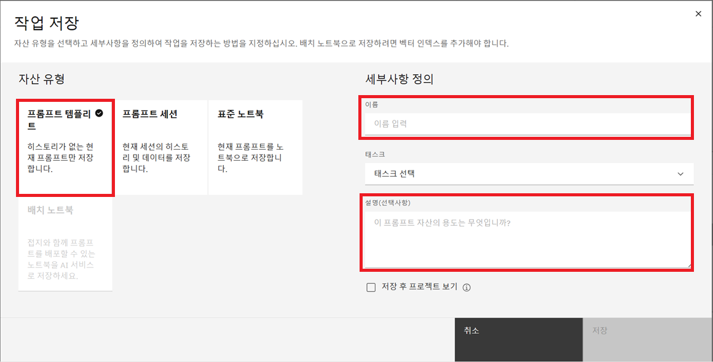

- 화면 좌측 **프롬프트 템플리트** 클릭
- **이름**과 **설명**을 입력합니다.
- 프로젝트 작성 화면에서 아래 규칙에 따라 이름과 설명을 작성합니다.
  - 다수의 인원이 한 자원을 사용하므로 반드시 명명규칙을 지켜 주시기 바랍니다.
  - 명명규칙 : <자기이름>_고객문의대응챗봇
- 이름(에시) 
  ```
  Junho_고객문의대응챗봇
  ```
- 설명
  ```
  고객 문의에 자동으로 대응하는 챗봇 실습을 위한 프롬프트 입니다.
  ```


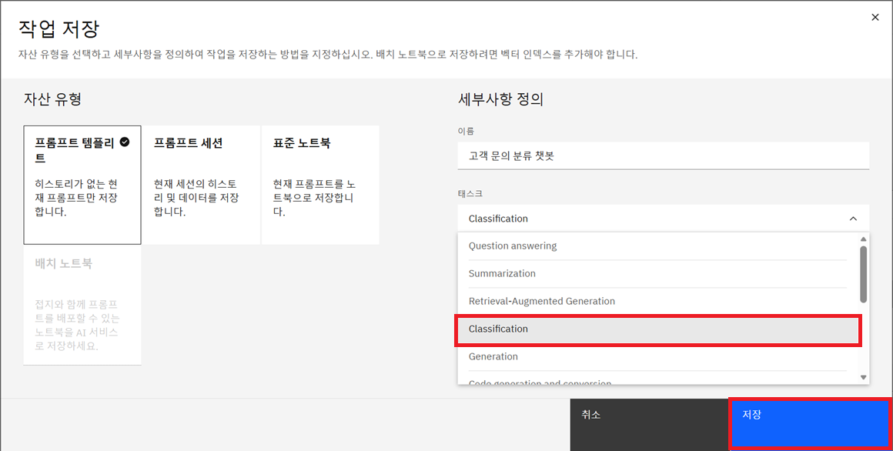

- 이름과 설명 입력 후, 테스크는 **Generation**으로 선택합니다.
- 설정이 모두 완료되었다면 우측 하단 **저장**을 클릭합니다.

## 6. Prompt Lab과 Python 연동하기

- Watsonx.ai studio Prompt Lab에서는 **코드 보기** 기능을 통해 로컬에서 바로 실행할 수 있도록 Python, Curl, Node.js 코드를 제공합니다.

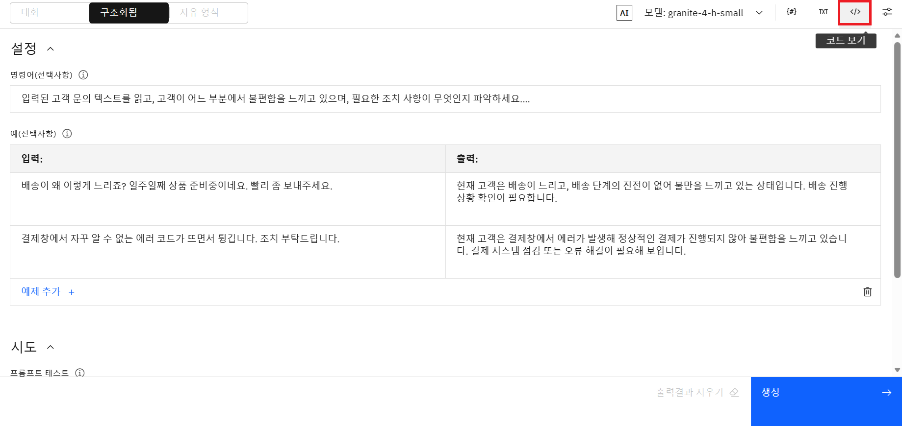

- 화면 우측 상단 **</>** 버튼을 클릭하면 화면 우측에 코드 창이 활성화됩니다.

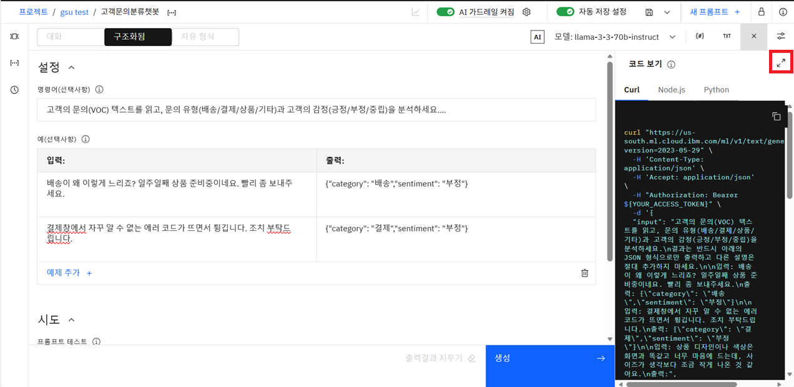

- 화면에서 **펼치기** 버튼을 클릭합니다.

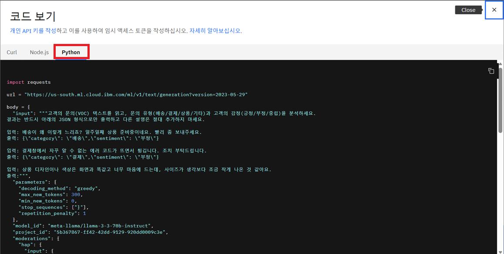

- 코드 창에서 언어를 원하는 언어로 **Python**, **Curl**, **Node.js** 중 선택할 수 있습니다.
- **Python**을 클릭해 전체 코드를 확인합니다.

```
Python 코드 구조

1. body : 지사사항, 예시, 파라미터 설정, 모델ID, 프로젝트 ID

2. header : 인증정보
```

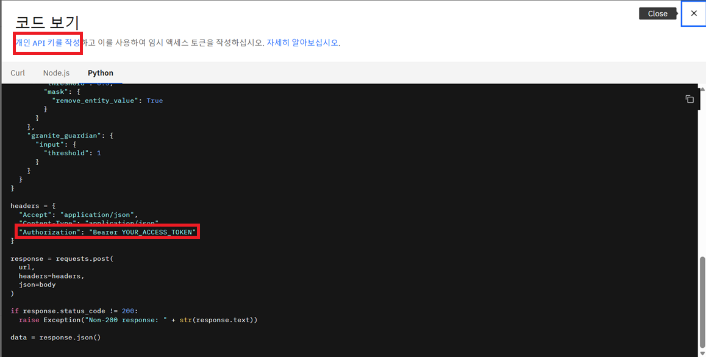

- 코드 보기 하단 문구를 살펴보면 **개인 API 키를 작성** 이라는 문구가 있습니다.
- Prompt Lab을 이용하기 위해서는 개인 인증을 위한 **ACCESS TOKEN**이 필요합니다. 
- **ACCESS TOKEN**을 발급받기 위해 **개인 API 키를 작성**을 클릭합니다.

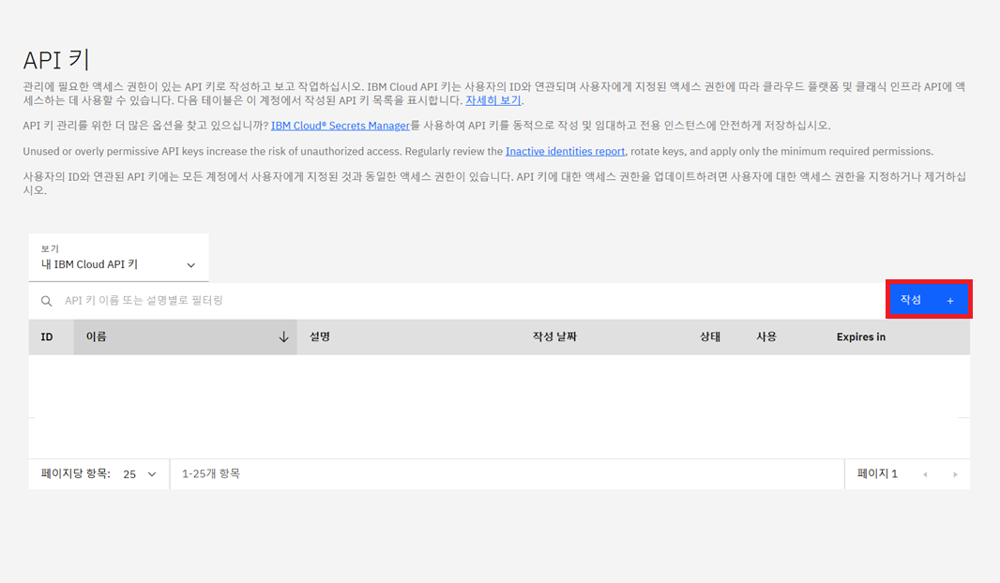

- 우측 **작성** 버튼을 클릭합니다.

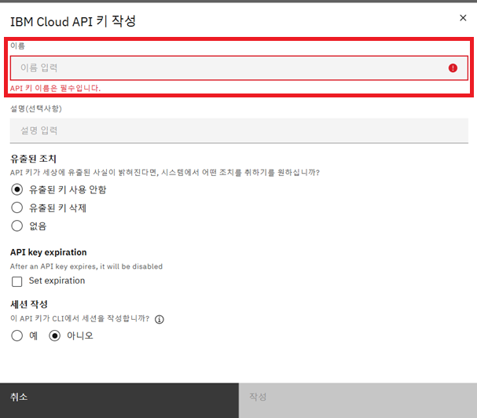

- **이름**을 입력합니다.
- 모든 설정을 그대로 두고 우측 하단 **작성** 버튼을 클릭합니다.

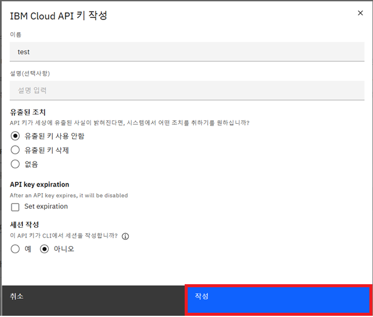

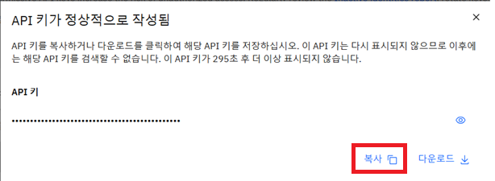

- 생성된 API Key를 **복사** 버튼을 클릭해 복사합니다. (.env 파일에서 사용됩니다.)
- <mark style = "background-color: yellow; border-radius: 3px"><b>이 키는 생성할 때 딱 한 번만 확인할 수 있기에 반드시 잘 복사해 기록해두어야 합니다.</b></mark>

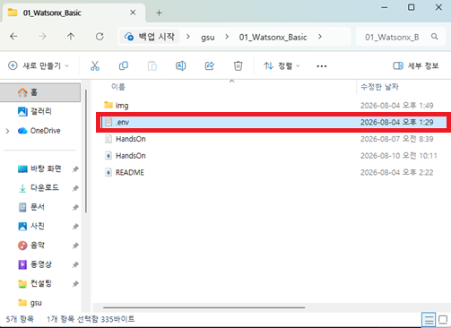
- 파일 탐색기에서 환경 세팅에서 다운받은 폴더로 이동하여 01_Watsonx_Basic 폴더 내에 .env 파일을 실행합니다.
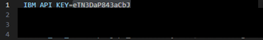
- .env 파일에 API KEY를 붙여넣고 저장합니다.

- 다시 prompt lab 화면으로 돌아갑니다.

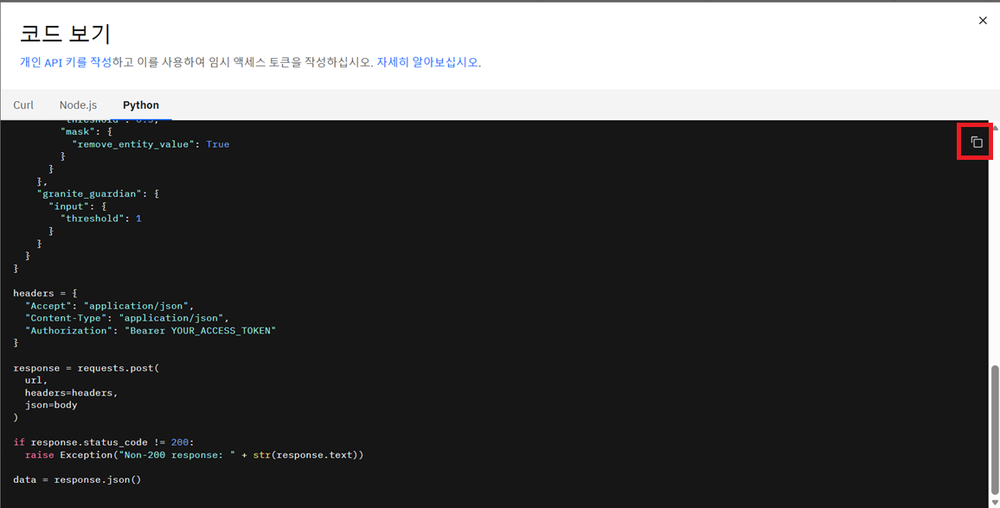

- 코드 창에서 **copy 아이콘**을 클릭합니다.
- 여기서 복사한 코드는 이후 진행되는 python_connect.ipynb에서 사용됩니다.

이 단계까지 완료했다면 Python 코드로 Prompt Lab을 사용할 준비가 완료되었습니다.
아래 링크를 클릭해 Prompt Lab을 Python으로 실행해 보세요.

<h3><a href="./python_connect.ipynb">Python Prompt Lab</a></h3>