## 1. Watsonx.ai Studio 접속하기
<a href="https://cloud.ibm.com/" target="_blank"><b>Watsonx.ai Studio 접속하기</b></a>
- 위 링크에 접속 후, 회원가입과 로그인을 진행합니다.


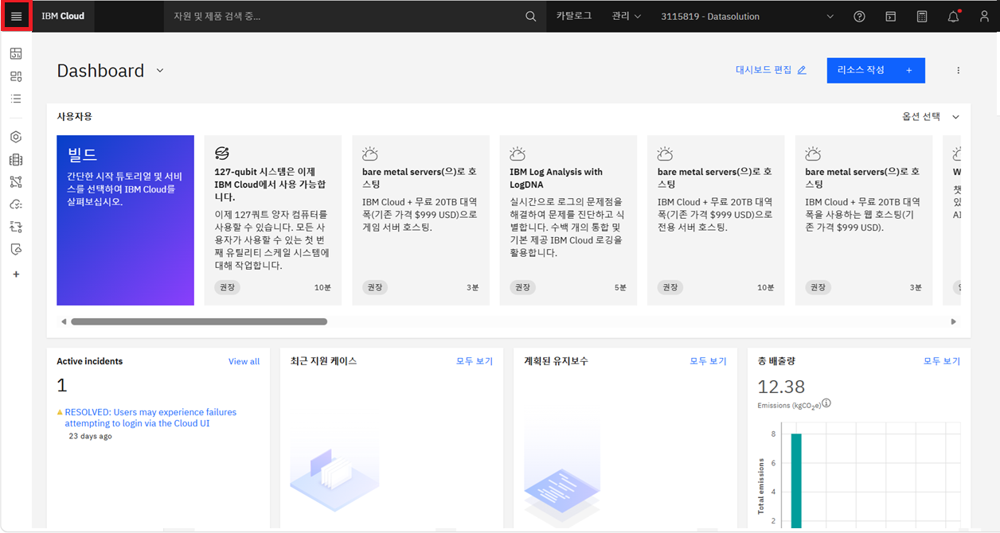

- 로그인 후, 좌측 상단 **햄버거 버튼**을 클릭합니다.

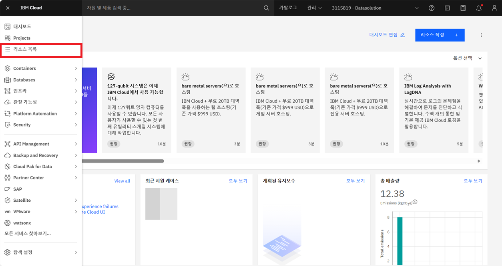

- **리소스 목록**을 클릭합니다.

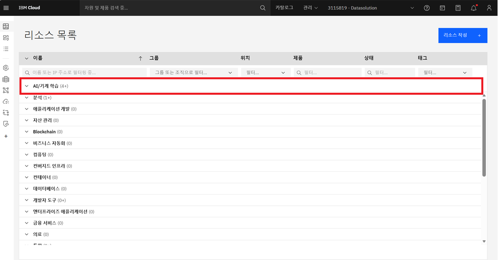

- 리소스 목록에서 **AI/기계 학습**의 **드롭다운 버튼**을 클릭합니다.

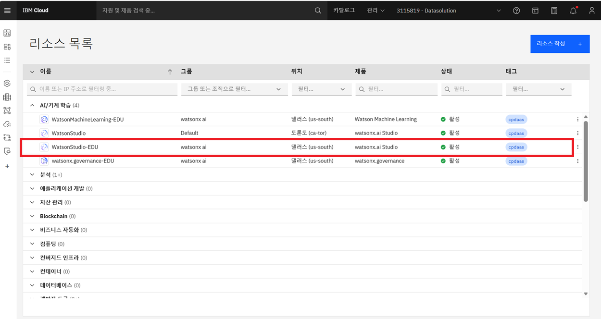

- 이름이 <교육명>으로 되어있는 것 중, 그룹이 watsonx.ai인 리소스를 클릭합니다.

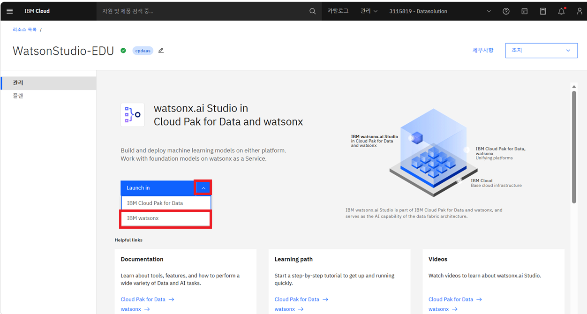

- Launch in 버튼의 오른쪽에 위치한 **드롭다운 버튼**을 클릭합니다.
- **IBM watsonx**를 클릭합니다.

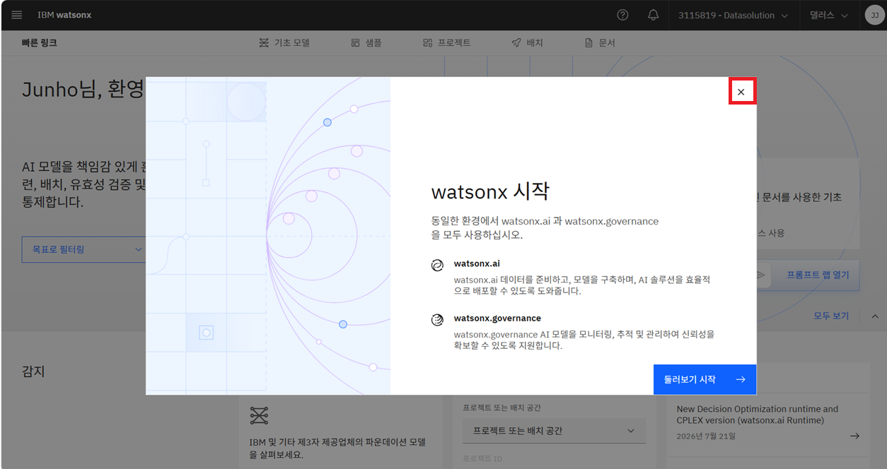

- 접속이 완료됐으면, 가이드 창을 닫아줍니다.

## 2. Project 생성
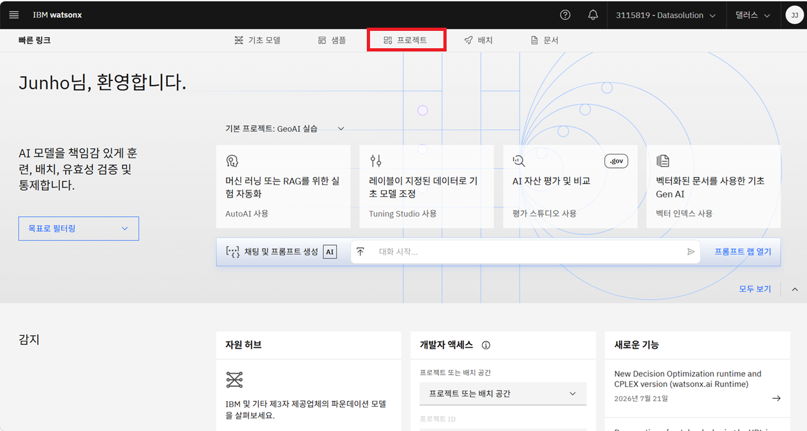

- 상단 메뉴 중 **프로젝트**를 클릭합니다.

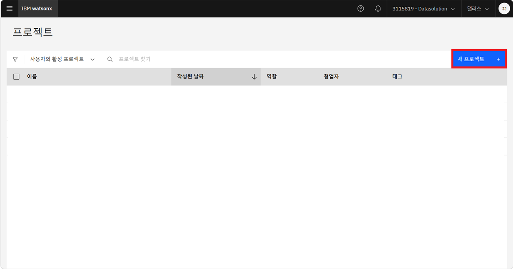

- 우측 상단 **새 프로젝트** 버튼을 클릭합니다.

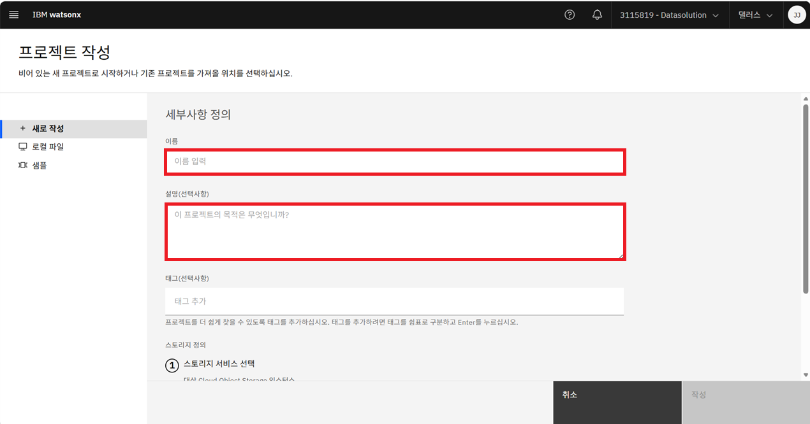

- 프로젝트 작성 화면에서 아래 규칙에 따라 이름과 설명을 작성합니다.
  - 다수의 인원이 한 자원을 사용하므로 반드시 명명규칙을 지켜 주시기 바랍니다.
  - 명명규칙 : <자기이름>_test
- 이름(에시) 
  ```
  Junho_test
  ```
- 설명
  ```
  Watsonx.ai studio Prompt Lab 실습을 위한 프로젝트입니다.
  ```

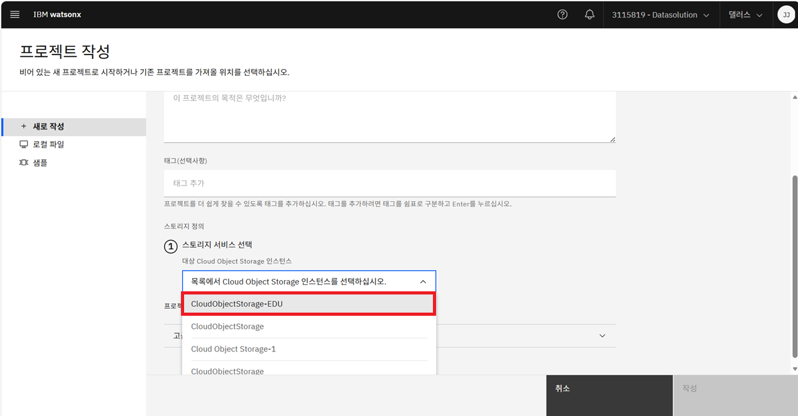

- **스토리지 서비스 선택**을 눌러 알맞은 스토리지를 선택합니다.

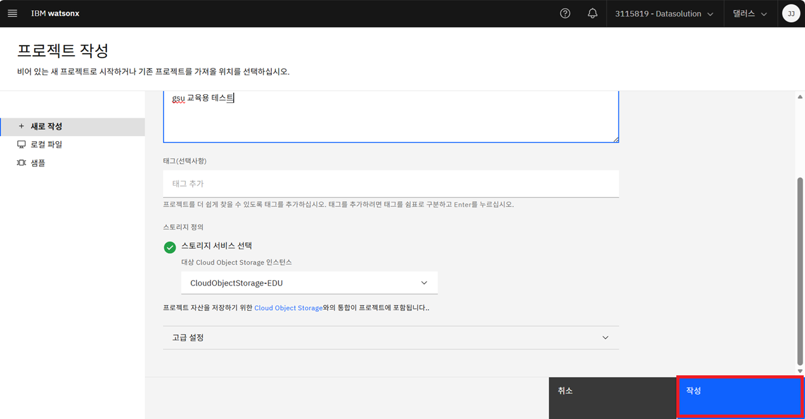

- 우측 하단 **작성** 버튼을 눌러 프로젝트 생성을 완료합니다.

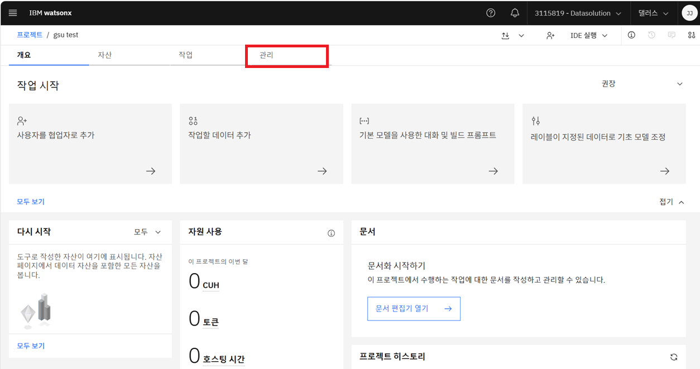

- 프로젝트 세부 화면에서 상단 **관리**를 클릭합니다.

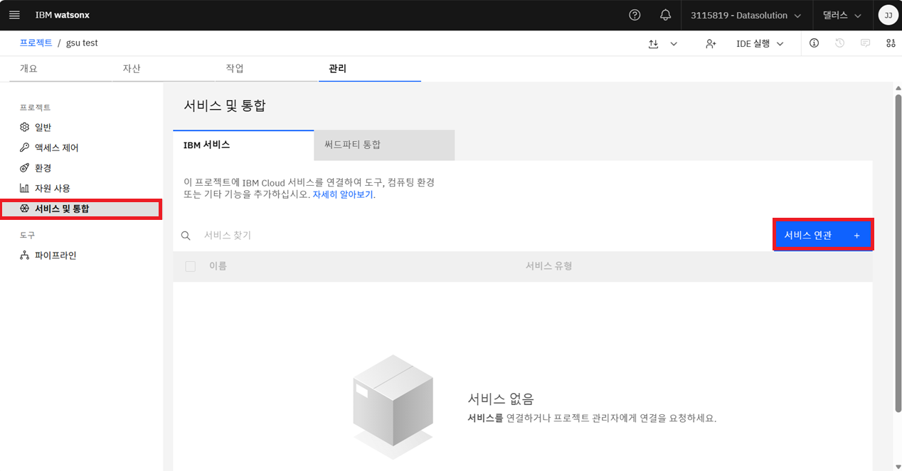

- 좌측 메뉴에서 **서비스 및 통합**을 클릭합니다.
- IBM 서비스에서 **서비스 연관** 버튼을 클릭합니다.

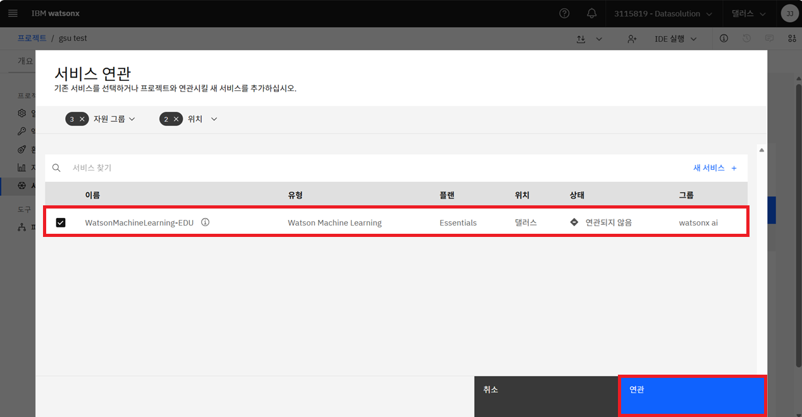

- 목록 중, 이름이 <교육 워크 스페이스명>이면서 유형이 Watson Machine Learning인 서비스를 체크합니다.
- 우측 하단 **연관** 버튼을 누릅니다.

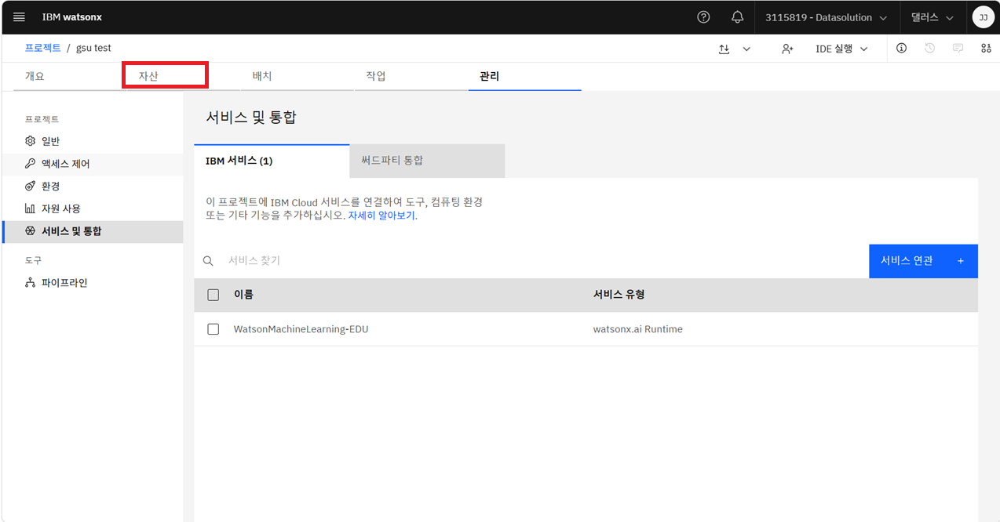

- 상단 메뉴 중 **자산**을 클릭합니다.

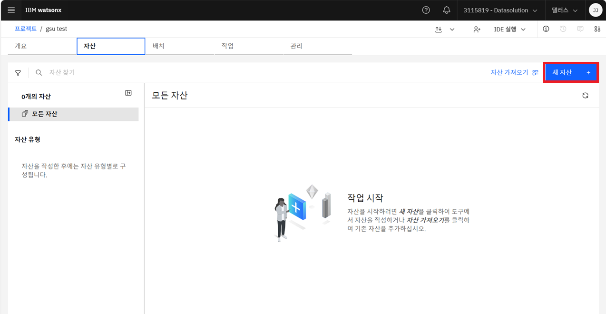

- 우측 상단 **새 자산** 버튼을 클릭합니다.

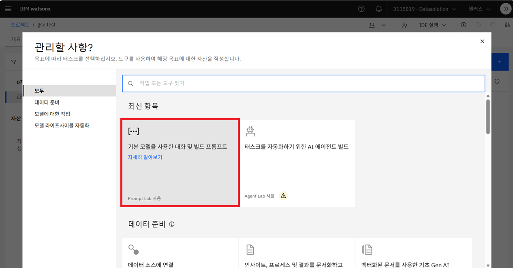

- 자산 목록 중 **기본 모델을 사용한 대화 및 빌트 프롬프트**를 클릭합니다.
- 만약 목록에 나타나지 않는다면 상단 검색창에 Prompt Lab을 검색 후, 선택합니다.

## Prompt Lab

**Prompt Lab이란?**
```
  다양한 LLM의 성능을 비교, 테스트 하고, 프롬프트의 파라미터를 최적화하여 실제 애플리케이션용 코드로 추출해 주는 개발 환경
```

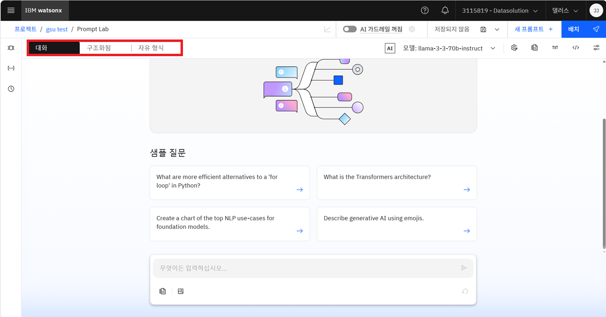


**Prompt Lab의 세 가지 종류**
```
  1. 챗(Chat)
    - LLM과 대화하며 LLM의 응답 특성을 파악
    - LLM 모델 선택, 파라미터 조정, 프롬프트 튜닝을 통한 모델 성능 테스트

  2. 구조화된 입력(Structured Input)
    - LLM에게 정해진 양식과 예시(Few-shot)를 주고 규칙적인 결과를 유도
    - 지시문(Instruction), 입/출력 예시, 실제 입력(Input)으로 구성

  3. 자유 형식 (Freeform)
    - 입력 칸이 나뉘어 있지 않고, 하나의 빈 텍스트 창만 제공
    - 입력 칸에 작성한 글의 다음 내용을 LLM이 작성하도록 함
```
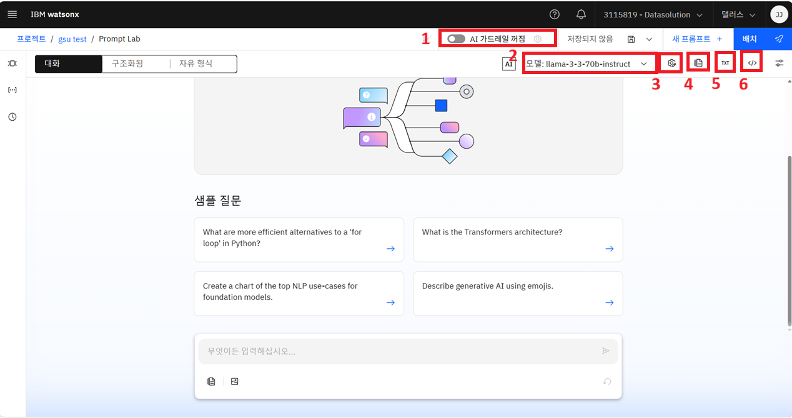

**Prompt Lab 메뉴**
```
  1. AI 가드레일 on/off
    - 혐오 발언, 비속어, 욕설 등 유해한 입력이나 응답을 제한
    - 기본 설정값은 on으로 되어있음

  2. 모델 선택
    - IBM Watson에서 제공하는 LLM 모델 선택

  3. 시스템 프롬프트 편집
    - 모델의 페르소나, 기초적인 지시사항을 정의하는 기능
    - 기본적으로 IBM에서 작성한 프롬프트가 입력되어 있음

  4. 문서로 접지
    - LLM이 참고할 수 있는 외부 문서를 제공하는 기능

  5. 전체 프롬프트 텍스트 보기
    - 입력 프롬프트, 시스템 프롬프트 등 전송되는 전체 프롬프트를 볼 수 있는 기능

  6. 코드 보기
    - 테스트한 모델을 코드 베이스로 바로 실행할 수 있도록 코드를 제공하는 기능
    - cURL, Python, NodeJS 등 지원
```

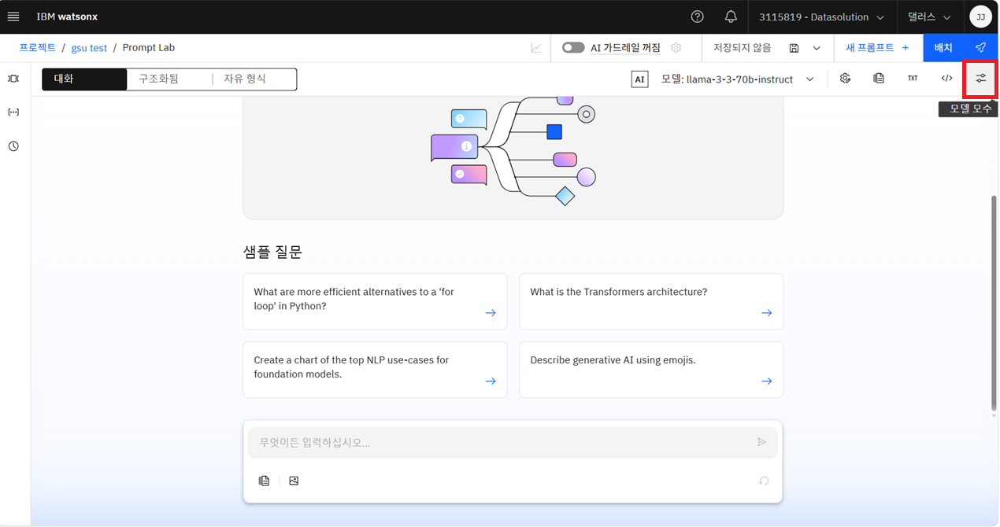
- **모델 모수** : 모델의 파라미터를 설정하는 기능

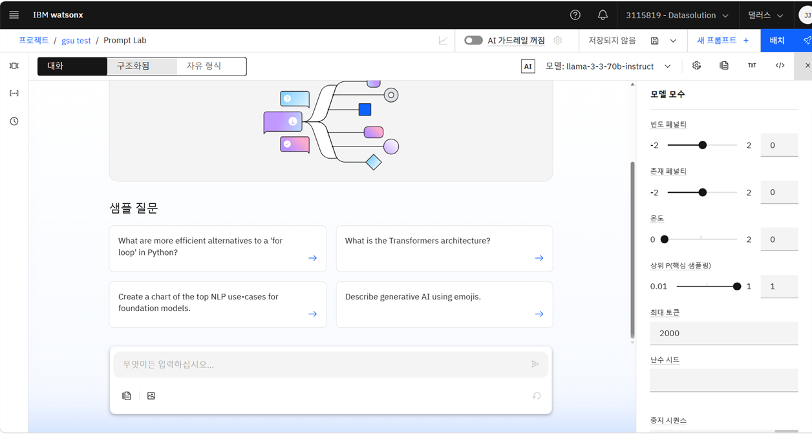

```
  1. 빈도 패널티
    - 이미 생성된 텍스트를 반복할 확률을 낮추는 기능
    - 높은 값일수록 다양한 단어 사용, 낮은 값일수록 반복 가능

  2. 존재 패널티
    - 생성할 텍스트와 이미 생성된 텍스트 간 단어의 빈도를 고려하여 이미 언급된 단어가 다시 등장할 확률을 낮추는 기능
    - 높은 값일수록 이미 언급된 단어를 재사용하지 않음 
    - 낮은 값일수록 이미 언급된 단어를 재사용 가능

  3. 온도
    - 모델이 생성하는 텍스트의 다양성을 조절
    - 기본값은 0.8
    - 높은 값일수록 창의적이고 다양한 텍스트, 낮은 값일수록 일관되고 정형화된 텍스트 생성

  4. Top-P
    - 특정 확률 값에 도달할 때까지 누적 확률을 계산해 후보군을 만들고 그 후보군 안에서 단어를 선택해 생성하는 파라미터

  5. 최대 토큰
    - LLM이 응답 생성 시, 사용할 수 있는 최대 토큰 수
    - 높은 값일수록 긴 텍스트 생성, 낮은 값일수록 짧은 텍스트 생성

  6. 난수 시드
    - 초기값을 난수로 설정하여 같은 결과물을 원할 때 사용(ML의 random_state 역할)
    - 설정값에 따른 영향 없음

  7. 중지 시퀀스
    - 특정 단어가 생성되면 LLM의 응답 생성을 중지하는 파라미터
```

